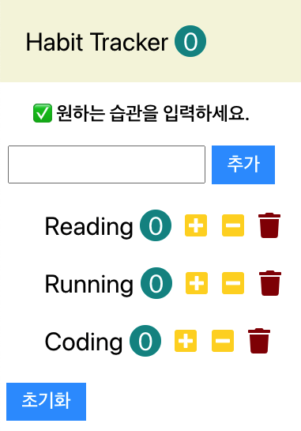
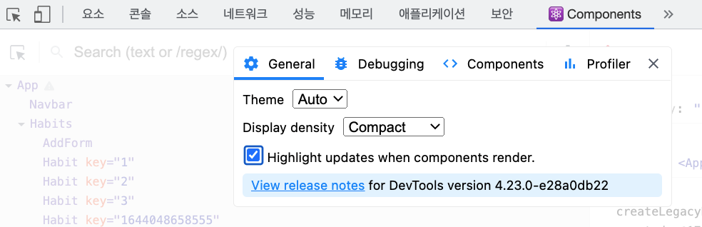

# react-practice

리액트 연습

## 소개

- 컴포넌트로 이루어진 UI 라이브러리
- MVC 디자인 패턴에서 View 레이어를 담당하고 있다.
- 즉, 사용자에게 UI를 보여주고 이벤트를 처리하는 일을 담당한다.

### 컴포넌트

- 컴포넌트는 로직과 상태가 응집되어 있는 독립적이고 재사용 가능한 블록이다.
- 컴포넌트끼리는 낮은 결합도를 가진다.
- 컴포넌트들도 DOM과 같이 트리 형식으로 구성되어 있다.
- state object가 변경되면 render function이 자동으로 다시 호출(리렌더링)하여 state의 값이 화면에 업데이트될 수 있도록 한다.
- 만약 render 함수 안에 자식 요소 컴포넌트가 들어 있다면 그들의 render 함수도 다시 호출(리렌더링)된다.
- 리액트 만의 Virtual DOM Tree에 컴포넌트 정보가 저장되어 있고, 이전의 DOM Tree와 비교해서 실제로 달라진 부분만 업데이트하므로 성능에는 크게 영향을 미치지 않는다.
- 또한 매번 업데이트하지 않고 업데이트해야 되는 내용들을 모았다가 한 번에 다같이 업데이트하여 60fps를 보장한다.

## 리액트 주요 개념

> 💡 Tip! 템플릿 복사 시 `cp -R template <project-name>` 명령어를 활용한다.

- 리액트는 결국 바벨에 의해 순수 자바스크립트로 변환된다.
- react-dom을 이용하여 HTML과 연결된다.

### JSX

[공식문서 읽기](https://reactjs.org/docs/jsx-in-depth.html)

> 💡 Tip! 폰트어썸 설치 명령어 `yarn add @fortawesome/fontawesome-free`

> `index.js`에도 `import '@fortawesome/fontawesome-free/js/all.js';` 를 추가해야 한다.

### SyntheticEvent

- 브라우저에서 발생하는 이벤트를 한단계 더 감싸서 컴포넌트에 전달하게 된다.

[공식문서 읽기](https://reactjs.org/docs/events.html)

### State, Props

- State는 컴포넌트 안에서 정의한 state 오브젝트
- Props는 컴포넌트 외부에서 제공받는 데이터로, 부모 컴포넌트에서 전달해주는 인자는 props 오브젝트로 묶여서 자식 컴포넌트에 전달된다.
- 전달받은 인자는 `this.props.`으로 접근할 수 있다.

### Refs

- 리액트에서 다른 리액트 요소에 접근하고 싶을 때 사용한다.

[공식문서 읽기](https://reactjs.org/docs/refs-and-the-dom.html)

## Habit Tracker 프로젝트 성능 분석

- 모든 컴포넌트의 render 함수마다 로그를 찍어 얼마만큼의 컴포넌트가 다시 호출(리렌더링)되는지 테스트하였다.
- state가 최상위인 App 컴포넌트에 들어 있으며 props로 넘겨주고 있는 구조기 때문에 모든 컴포넌트가 매번 호출된다.
- 하지만 리액트의 Virtual DOM이 실제로 정말 업데이트 되어야 하는 요소만 DOM에 업데이트하기 때문에 성능에 크게 문제는 없다.
- 그럼에도 매번 모든 컴포넌트의 render 함수가 호출되기 때문에 좋지 않다.
  
  - 위와 같이 설정해두면 확인할 수 있다.
- PureComponent, memo를 이용하면 컴포넌트에 state나 props에 변화가 없다면 render 함수가 호출되지 않는다.
- PureComponent는 정확히는 shouldComponentUpdate를 구현한, 컴포넌트를 업데이트해야 할지를 물어보는 함수를 구현한 컴포넌트이다.
  - 이전의 props, state와 얕은 비교를 한다. 즉, 동일한 객체 레퍼런스인지만 비교한다. 따라서 객체의 내용이 바뀌어도 동일한 오브젝트이면 리렌더링이 일어나지 않는다.
